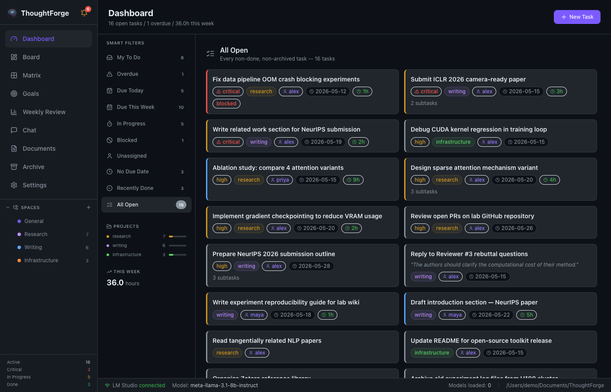
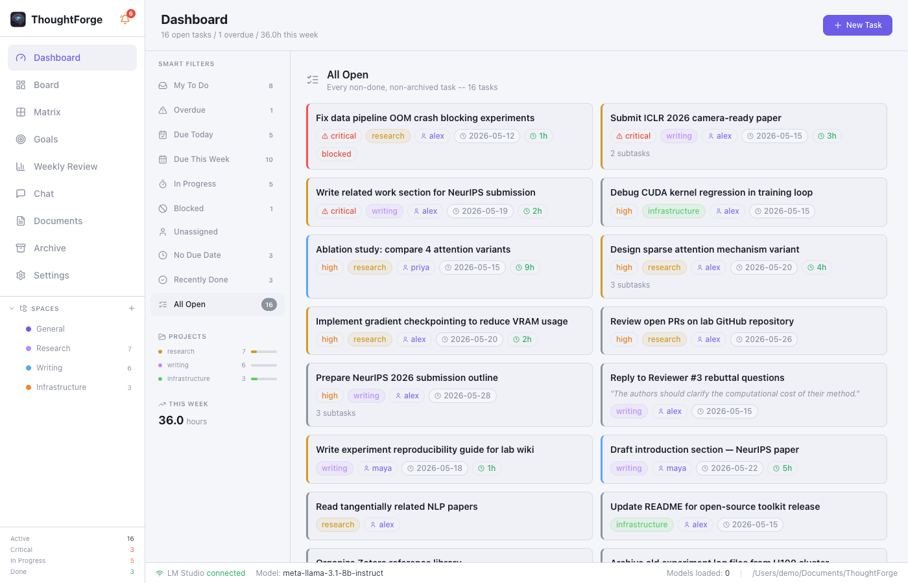
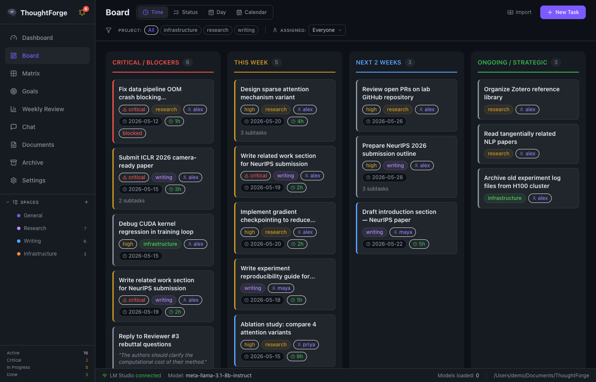
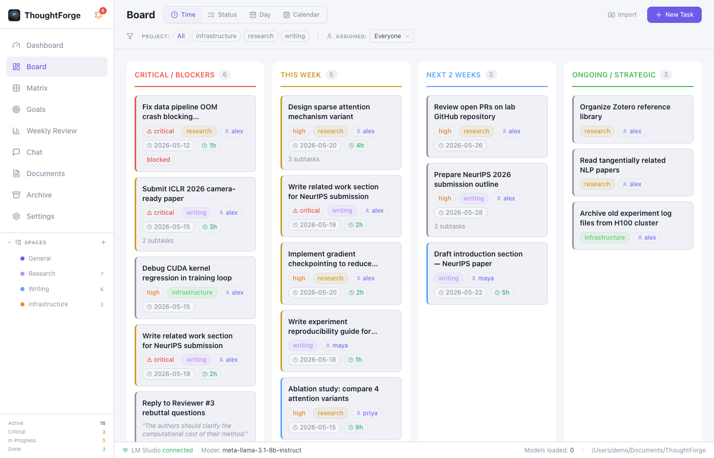
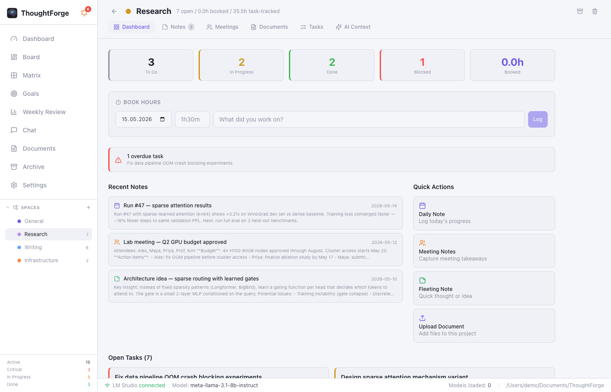
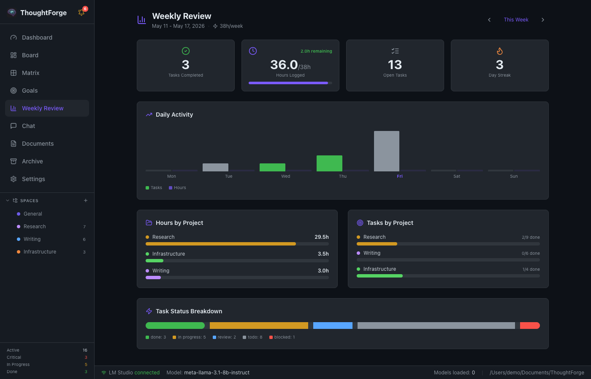
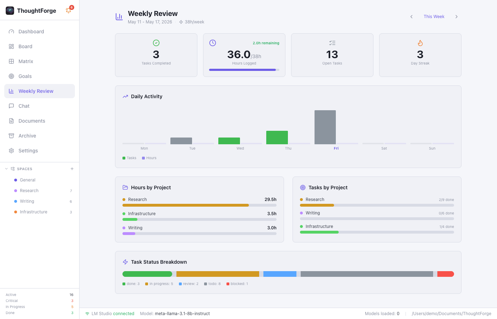
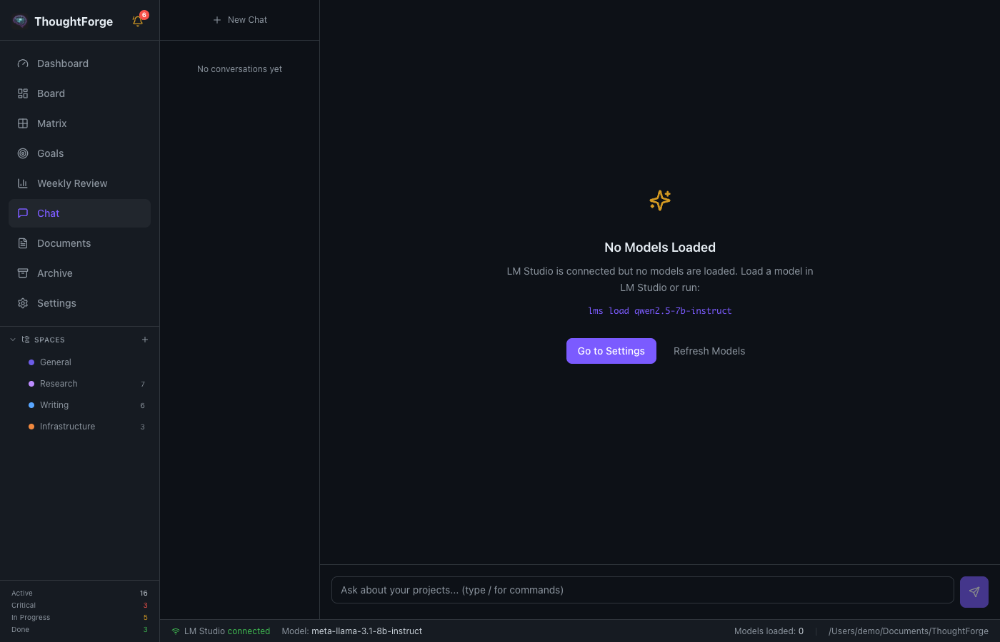
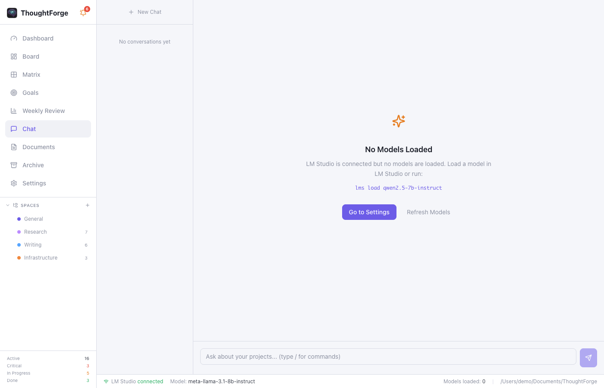
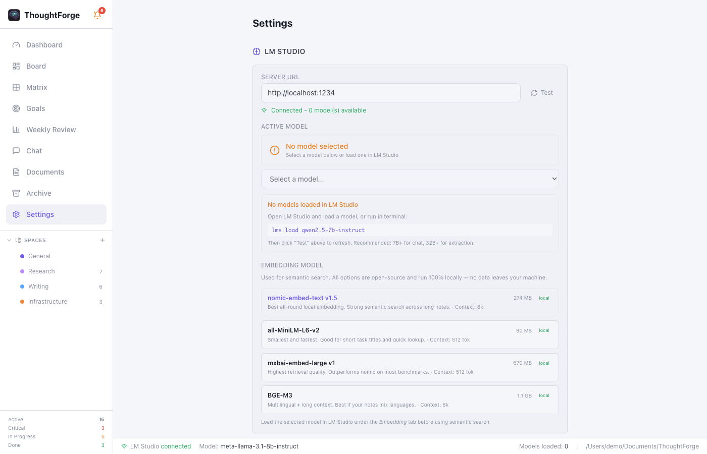

# ThoughtForge


A local-first AI planning assistant. Extracts action items from meeting transcripts, manages tasks on a kanban board, and uses a local LLM (via LM Studio) for smart planning — all without sending data to the cloud.

## Screenshots

| View | Dark | Light |
|------|------|-------|
| Dashboard |  |  |
| Kanban Board |  |  |
| Space & Notes |  |  |
| Weekly Review |  |  |
| AI Chat |  |  |
| Settings |  |  |

## Features

- **Dashboard** — smart filters: My Tasks, Overdue, Due Today, Blocked, by project
- **Kanban Board** — Time-based, Status, Day-by-day, and Calendar views
- **Spaces** — per-project workspace with notes, tasks, booked hours, and semantic search
- **AI Chat** — daily/weekly planning via local LLM; changes confirmed before writing
- **Document Processing** — upload transcripts (.txt, .md, .pdf), auto-extract action items
- **Time Tracking** — book hours per space, weekly timesheet grid, daily activity chart
- **Semantic Search** — per-space vector index powered by LM Studio embeddings
- **Model Recommendations** — RAM-aware model suggestions with LM Studio copy-paste commands
- **100% Local** — no network calls except localhost. No telemetry.

## Architecture

| Layer | Technology |
|-------|-----------|
| App framework | Tauri 2.x (Rust backend) |
| Frontend | React 19 + TypeScript |
| Styling | Tailwind CSS |
| State | Zustand |
| LLM | OpenAI-compatible API via LM Studio |
| Storage | Markdown + JSON files |

### Storage layout

```
~/Documents/ThoughtForge/
  spaces/
    {id}/
      space.json        # metadata (name, color, time entries)
      notes/
        {note-id}.md    # YAML frontmatter + markdown body
      tasks/
        {task-id}.md    # YAML frontmatter + notes body
      search_index.json # per-space vector index
  boards/
    kanban.md
  uploads/
    transcripts/
    documents/
  config.yaml
```

## Prerequisites

- **macOS / Windows / Linux**
- **Rust** (1.70+): `curl --proto '=https' --tlsv1.2 -sSf https://sh.rustup.rs | sh`
- **Node.js** (20+): `brew install node`
- **LM Studio**: [lmstudio.ai](https://lmstudio.ai) — for AI features

## Setup

```bash
git clone https://github.com/larsroettig/thoughtforge.git
cd thoughtforge
npm install
```

### Development

```bash
npm run tauri dev
```

### Production Build

```bash
npm run tauri build
```

Produces a `.app` bundle and `.dmg` installer in `src-tauri/target/release/bundle/`.

## LM Studio Setup

1. Install [LM Studio](https://lmstudio.ai) and load models:
   ```
   lms load qwen2.5-14b-instruct        # chat (recommended for 16–32 GB RAM)
   lms load nomic-embed-text-v1.5       # embeddings (for semantic search)
   ```
2. In ThoughtForge → Settings → verify URL is `http://localhost:1234`
3. Select your chat model from the dropdown

See **Settings → Model Recommendations** for RAM-matched model suggestions.

## AI Chat

The chat connects to your local LLM and can **propose task modifications**:

1. Ask "plan my day" or "change priority of X to high"
2. The AI responds with proposed changes
3. A confirmation card appears — review each change, apply or skip individually
4. The AI never writes to your vault without explicit confirmation

### Slash Commands

| Command | Description |
|---------|-------------|
| `/plan-day` | Daily plan with priorities and time blocks |
| `/plan-week` | Day-by-day weekly breakdown |
| `/status` | Overview of all projects and blockers |
| `/blocked` | Show blocked or overdue items |
| `/extract` | Extract action items from pasted text |
| `/summarize` | Summarize a project |
| `/prioritize` | Suggest priority ordering |

## MCP Server (Claude Desktop Integration)

ThoughtForge ships a built-in [Model Context Protocol](https://modelcontextprotocol.io) server. Enable it in **Settings → MCP & Integrations**, then add the server to `claude_desktop_config.json`:

```json
{
  "mcpServers": {
    "thoughtforge": {
      "command": "/Applications/ThoughtForge.app/Contents/MacOS/vaultmind-mcp",
      "args": ["--stdio"]
    }
  }
}
```

Available tools: `list_tasks`, `create_task`, `update_task`, `delete_task`, `list_spaces`, `list_notes`, `create_note`, `search_notes`, `list_goals`, `create_goal`, `update_goal`, `delete_goal`.

See **[docs/mcp.md](docs/mcp.md)** for the full tool reference and HTTP transport setup.

## Documentation

- **[User Guide](docs/user-guide.md)** — getting started, all features explained
- **[MCP Server](docs/mcp.md)** — Claude Desktop integration, tool reference, security
- **[GitHub Pages](https://larsroettig.github.io/thoughtforge/)** — landing page

## Testing

```bash
npm test                          # TypeScript/Vitest
cd src-tauri && cargo test        # Rust unit tests
```

## Author

Built by **Lars Roettig**.

## License

MIT
